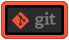
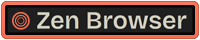

# logo-gallery

## Description

:mega: Hi there :wave: !

This [dogfooding](https://en.wikipedia.org/wiki/Eating_your_own_dog_food) repo is on :construction: WIP for uploads and automation. 
Dedicated repository to host some images and logos.
Squares type logo are available for now, several versions coming up soon (dimensions, colors, backgrounds, etc)

Available dimensions *(height-based)* :

|type|name|example|comments|
|:--:|:--|:--:|:--|
|Square|`square-{x}-60.png`||will be replaced by `square-b-{x}-60.png`|
|Rectangle|`rectangle-{x}-30.png`||will be replaced by `rectangle-b-{x}-40.png`|
|Square|`square-b-{x}-60.png`||...|
|Rectangle|`rectangle-b-{x}-40.png`||...|

(where {x} is for differents versions)

## How to use

1. Select the latest available tag version : `v0.2.12`
2. Copy the url
3. Enjoy it!

## Roadmap

* [ ] Automation, automation, automation! ([`github-actions`](https://github.com/features/actions))
* [ ] Using [`github-pages`](https://pages.github.com/)
* [ ] Make minimum 2 versions (Dark, light) for each logo
* [ ] Looking for another formats

## Sets

Logos grouped by themes to improve vizualisations and reorganisation

... [coming soon](./sets.md)

## Requests

Some brands are missing? Feel free to create the related issue. 

## Deprecated

Advises about risks or negative outcomes of certain actions.
URL links will be removed in next versions, please use logos in above sections.

## Logos
||||
|:--:|:--:|:--:|
|     `android`|     `androidstudio`|     `angular`|
|     `angularjs`|     `ansible`|     `apple`|
|     `appleintelligence`|     `appstore`|     `arc`|
|     `arduino`|     `artifactory`|     `atom`|
|     `aws`|     `azure`|     `bash`|
|     `blender`|     `bluesky`|     `bootstrap`|
|     `bower`|     `brave`|     `canonical`|
|     `centos`|     `chatgpt`|     `chrome`|
|     `circleci`|     `claude`|     `cockroachdb`|
|     `coffeescript`|     `copilot`|     `cordova`|
|     `couchdb`|     `csharp`|     `css3`|
|     `dart`|     `datagrip`|     `datastudio`|
|     `dbeaver`|     `debian`|     `deepseek`|
|     `discord`|     `django`|     `docker`|
|     `dockercompose`|     `duckdb`|     `edge`|
|     `elasticsearch`|     `emberjs`|     `extjs`|
|     `facebook`|     `fedora`|     `filezilla`|
|     `firebase`|     `firefox`|     `flutter`|
|     `forticlient`|     `gemini`|     `gimp`|
|     `git`|     `github`|     `githubactions`|
|     `gitlab`|     `gitlabcicd`|     `go`|
|     `googlecloud`|     `googleplay`|     `gradle`|
|     `grails`|     `graphql`|     `grok`|
|     `grunt`|     `guake`|     `gulpjs`|
|     `h2`|     `harbor`|     `helm`|
|     `heroku`|     `html5`|     `httpie`|
|     `icloud`|     `ifttt`|     `illustrator`|
|     `instagram`|     `intellij`|     `ionic`|
|     `ios`|     `jadelang`|     `java`|
|     `javascript`|     `jenkins`|     `jules`|
|     `jupyter`|     `kafka`|     `kaggle`|
|     `kapitan`|     `kibana`|     `kotlin`|
|     `kubernetes`|     `linkedin`|     `linux`|
|     `linuxmint`|     `logstash`|     `macos`|
|     `mariadb`|     `mastodon`|     `materializecss`|
|     `matplotlib`|     `mattermost`|     `maven`|
|     `messenger`|     `meta`|     `metaai`|
|     `microk8s`|     `microsoft`|     `microsoft365`|
|     `mistralai`|     `ml5js`|     `mongodb`|
|     `mozilla`|     `mozillavpn`|     `multipass`|
|     `mxlinux`|     `mysql`|     `nextjs`|
|     `nexus`|     `nginx`|     `ngrx`|
|     `nodejs`|     `notepad++`|     `npm`|
|     `o3de`|     `office365`|     `opera`|
|     `operagx`|     `oracle`|     `outlook`|
|     `p5js`|     `pandas`|     `parquet`|
|     `photoshop`|     `plotly`|     `portainer`|
|     `postgresql`|     `postman`|     `powerbi`|
|     `python`|     `rabbitmq`|     `rails`|
|     `reactjs`|     `redhat`|     `redux`|
|     `remmina`|     `rocketchat`|     `ruby`|
|     `rundeck`|     `safari`|     `saltstack`|
|     `sass`|     `schemacrawler`|     `sdkman`|
|     `seaborn`|     `slack`|     `snapcraft`|
|     `spring`|     `sqlite`|     `sqlserver`|
|     `sublimetext`|     `swagger`|     `swift`|
|     `tailwindcss`|     `tanzu`|     `teams`|
|     `telegram`|     `tensorflow`|     `terminal`|
|     `threads`|     `thunderbird`|     `travisci`|
|     `typescript`|     `ubuntu`|     `unity`|
|     `unrealengine`|     `vagrant`|     `vim`|
|     `virtualbox`|     `vivaldi`|     `vscode`|
|     `vuejs`|     `webstorm`|     `whatsapp`|
|     `windows10`|     `windows11`|     `x`|
|     `xbox`|     `yarn`|     `zapier`|
|     `zenbrowser`|...|...|
