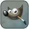
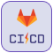
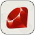

# logo-gallery

:mega: Hi there :wave: ! 

This [dogfooding](https://en.wikipedia.org/wiki/Eating_your_own_dog_food) repo is on :construction: WIP for uploads and automation,
links can be broken in futures versions, it is strongly recommended to waiting for tags :label: for safe using ! 

Dedicated to host logo for reusability

## :speech_balloon: Description

Dedicated repository to host some images and logos.

Available dimensions *(height-based)* :
* `40px`
* `80px`
* `120px`

Available types (depends on each logo) :
* `full`
* `logo only`
* `text only`

## :sparkles: Logos

|logo|name|logo|name|logo|name|
|:--:|:---|:--:|:---|:--:|:---|
||`android`||`androidstudio`||`angular`||`angular`|
||`angularjs`||`ansible`||`app-store`||`app-store`|
||`arduino`||`artifactory`||`atom`||`atom`|
||`aws`||`azure`||`bash`||`bash`|
||`blender`||`bootstrap`||`bower`||`bower`|
||`circleci`||`cockroachdb`||`cordova`||`cordova`|
||`couchdb`||`csharp`||`css3`||`css3`|
||`dart`||`datagrip`||`datastudio`||`datastudio`|
||`dbeaver`||`django`||`docker`||`docker`|
||`docker-compose`||`elasticsearch`||`emberjs`||`emberjs`|
||`firebase`||`flutter`||`gimp`||`gimp`|
||`git`||`github`||`github-actions`||`github-actions`|
||`gitlab`||`gitlab-cicd`||`go`||`go`|
||`googlecloud`||`google-play`||`gradle`||`gradle`|
||`graphql`||`grunt`||`gulpjs`||`gulpjs`|
||`h2`||`harbor`||`helm`||`helm`|
||`heroku`||`html5`||`icloud`||`icloud`|
||`ifttt`||`illustrator`||`intellij`||`intellij`|
||`ionic`||`ios`||`java`||`java`|
||`javascript`||`jenkins`||`kafka`||`kafka`|
||`kibana`||`kotlin`||`kubernetes`||`kubernetes`|
||`linkedin`||`logstash`||`mariadb`||`mariadb`|
||`materializecss`||`mattermost`||`maven`||`maven`|
||`ml5js`||`mongodb`||`mysql`||`mysql`|
||`nexus`||`nginx`||`ngrx`||`ngrx`|
||`nodejs`||`notepad++`||`npm`||`npm`|
||`oracle`||`p5js`||`photoshop`||`photoshop`|
||`postgresql`||`postman`||`powerbi`||`powerbi`|
||`python`||`rabbitmq`||`rails`||`rails`|
||`reactjs`||`redux`||`rocketchat`||`rocketchat`|
||`ruby`||`saltstack`||`sass`||`sass`|
||`slack`||`spring`||`sqlite`||`sqlite`|
||`sqlserver`||`sublimetext`||`swagger`||`swagger`|
||`swift`||`tanzu`||`tensorflow`||`tensorflow`|
||`travis-ci`||`typescript`||`unity`||`unity`|
||`vagrant`||`vim`||`virtualbox`||`virtualbox`|
||`vscode`||`vuejs`||`webstorm`||`webstorm`|
||`yarn`||`zapier`|...|...|

### :stop_sign: Legacy

**Deprecated**

URL links will be removed in next versions, please use logos in above sections.

