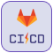

# logo-gallery

## Description

:mega: Hi there :wave: !

This [dogfooding](https://en.wikipedia.org/wiki/Eating_your_own_dog_food) repo is on :construction: WIP for uploads and automation.

Currently version :  `v0.2.6`

Dedicated repository to host some images and logos.
Squares type logo are available for now, several versions coming up soon (dimensions, colors, backgrounds, etc)

## Formats

Available dimensions *(height-based)* :

### Square

* `square-{x}-60.png`

(where {x} is for differents versions)

### Rectangle

* `rectangle-{x}-30.png`

 (where {x} is for differents versions)

## How to use

1. Select the latest available tag version
2. Copy the url
3. Enjoy it!

## Roadmap

* [ ] Automation, automation, automation! ([`github-actions`](https://github.com/features/actions))
* [ ] Using [`github-pages`](https://pages.github.com/)
* [ ] Make minimum 2 versions (Dark, light) for each logo
* [ ] Looking for another formats

> [!CAUTION]
> Deprecated
>
> Advises about risks or negative outcomes of certain actions.
> URL links will be removed in next versions, please use logos in above sections.
>
> 
> 
> 
> 

## Requests

Some brands are missing? Feel free to create the related issue. 

## Logos
|logo|logo|logo|
|:--:|:--:|:--:|
|      `android`   Android \| [website](https://www.android.com)|      `androidstudio`   Android Studio \| [website](https://developer.android.com/studio)|      `angular`   Angular \| [website](https://angular.dev/)|
|      `angularjs`   AngularJS \| [website](https://angularjs.org)|      `ansible`   Ansible \| [website](https://www.redhat.com/en/technologies/management/ansible)|      `apple`   Apple \| [website](https://www.apple.com/)|
|      `appstore`   App Store \| [website](https://www.apple.com/app-store)|      `arduino`   Arduino \| [website](https://www.arduino.cc/)|      `artifactory`   Artifactory \| [website](https://jfrog.com/artifactory)|
|      `atom`   Atom \| [website](https://atom-editor.cc)|      `aws`   AWS \| [website](https://aws.amazon.com)|      `azure`   Azure \| [website](https://azure.microsoft.com)|
|      `bash`   Bash \| [website](https://www.gnu.org/software/bash)|      `blender`   Blender \| [website](https://www.blender.org)|      `bootstrap`   Bootstrap \| [website](https://getbootstrap.com)|
|      `bower`   Bower \| [website](https://bower.io)|      `canonical`|      `centos`|
|      `chrome`|      `circleci`|      `cockroachdb`|
|      `coffeescript`|      `cordova`|      `couchdb`|
|      `csharp`|      `css3`|      `dart`|
|      `datagrip`|      `datastudio`|      `dbeaver`|
|      `debian`|      `discord`|      `django`|
|      `docker`|      `docker-compose`|      `edge`|
|      `elasticsearch`|      `emberjs`|      `extjs`|
|      `fedora`|      `filezilla`|      `firebase`|
|      `firefox`|      `flutter`|      `forticlient`|
|      `gimp`|      `git`|      `github`|
|      `githubactions`|      `gitlab`|      `gitlabcicd`|
|      `go`|      `googlecloud`|      `googleplay`|
|      `gradle`|      `grails`|      `graphql`|
|      `grunt`|      `guake`|      `gulpjs`|
|      `h2`|      `harbor`|      `helm`|
|      `heroku`|      `html5`|      `httpie`|
|      `icloud`|      `ifttt`|      `illustrator`|
|      `intellij`|      `ionic`|      `ios`|
|      `jadelang`|      `java`|      `javascript`|
|      `jenkins`|      `kafka`|      `kapitan`|
|      `kibana`|      `kotlin`|      `kubernetes`|
|      `linkedin`|      `linux`|      `linuxmint`|
|      `logstash`|      `macos`|      `mariadb`|
|      `materializecss`|      `mattermost`|      `maven`|
|      `microk8s`|      `microsoft`|      `microsoft365`|
|      `ml5js`|      `mongodb`|      `mozilla`|
|      `mozillavpn`|      `multipass`|      `mxlinux`|
|      `mysql`|      `nextjs`|      `nexus`|
|      `nginx`|      `ngrx`|      `nodejs`|
|      `notepad++`|      `npm`|      `o3de`|
|      `office365`|      `oracle`|      `outlook`|
|      `p5js`|      `photoshop`|      `portainer`|
|      `postgresql`|      `postman`|      `powerbi`|
|      `python`|      `rabbitmq`|      `rails`|
|      `reactjs`|      `redhat`|      `redux`|
|      `remmina`|      `rocketchat`|      `ruby`|
|      `rundeck`|      `safari`|      `saltstack`|
|      `sass`|      `schemacrawler`|      `sdkman`|
|      `slack`|      `snapcraft`|      `spring`|
|      `sqlite`|      `sqlserver`|      `sublimetext`|
|      `swagger`|      `swift`|      `tanzu`|
|      `teams`|      `tensorflow`|      `terminal`|
|      `thunderbird`|      `travisci`|      `typescript`|
|      `ubuntu`|      `unity`|      `unrealengine`|
|      `vagrant`|      `vim`|      `virtualbox`|
|      `vscode`|      `vuejs`|      `webstorm`|
|      `windows10`|      `windows11`|      `xbox`|
|      `yarn`|      `zapier`|...|
