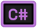

# Sets
|set|logos|
|:--:|:---|
| `ai`|         |
| `application`|                              |
| `cloud`|     |
| `coding`|                                                      |
| `database`|             |
| `dataviz`|      |
| `operatingsystem`|            |
| `socialnetwork`|          |
| `webbrowser`|          |
| `other`|                                              |

